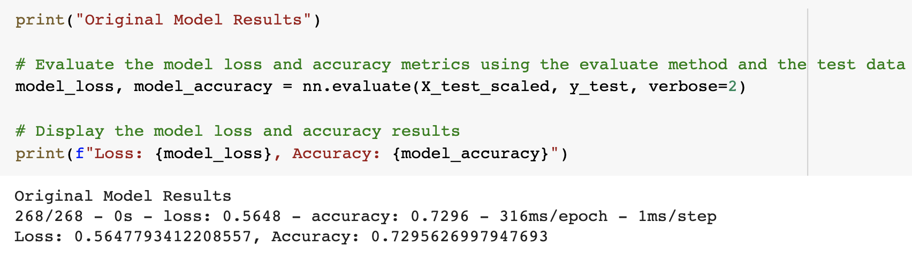
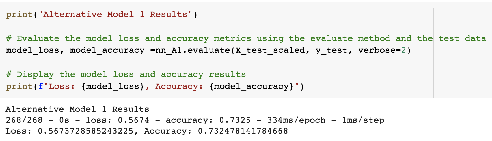
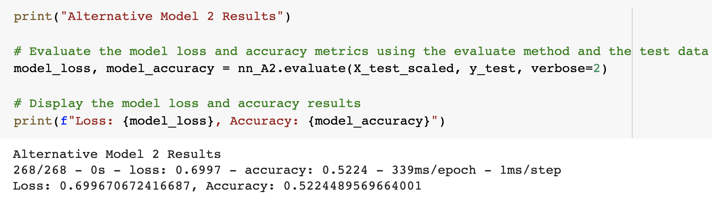

# Venture_Success_Predictor
---
Binary classification model using a deep neural network

[Google Colab Link:](https://colab.research.google.com/drive/1LpW-ayOTwpAQVkVCPYTlnMvPaGVJwL_x?usp=sharing)

Background

Alphabet Soup is a venture capital firm. It's business team receives many funding applications from startups every day. This team has asked me to help them create a model that predicts whether applicants will be successful if funded by Alphabet Soup.
The business team has given me a CSV file containing more than 34,000 organizations that have received funding from Alphabet Soup over the years. The CSV file contains a variety of information about each business, including whether or not it ultimately became successful. 

To predict whether Alphabet Soup funding applicants will be successful, I will create a binary classification model using a deep neural network.
This challenge consists of three technical deliverables:

* Preprocess data for a neural network model.

* Use the model-fit-predict pattern to compile and evaluate a binary classification model.

* Optimize the neural network model.

## Technologies
This project runs on python 3.7 and includes the following libraries and dependencies:

* Pandas
* tensorflow
* keras
* sklearn
* Dense
* sequential
* train_test_split
* StandardScaler
* OneHotEncoder
* GoogleColab

### Usage

To use this application just clone the repository on Google Colab and run the provided code in the Install and import the required libraries and dependencies section.

* The first cell will install the necessary libraries into the Google Colab runtime.

* The second cell will import the dependencies for use in the notebook.

Upon launching the application  on Colab  run the file by clicking on the play button on the left of the each cell of the notebook. 

---

## Results ##

## Original Model Result ##
* Number of inputs(features) - 116
* number of hidden layer - 2
* Number of nodes in first hidden layer - 58
* Number of nodes in second hidden layer - 29
* Activation function - 'relu'
* Loss function - 'binary_crossentropy'
* number of epochs - 50

## Alternative Model 1 Result ##

* Number of inputs(features) - 116
* number of hidden layer - 1
* Number of nodes in  hidden layer- 58
* Activation function - 'relu'
* Loss function - 'binary_crossentropy'
* number of epochs - 70

## Alternative Model 2 Result ##

* Number of inputs(features) - 116
* number of hidden layer - 3
* Number of nodes in first hidden layer - 58
* Number of nodes in second hidden layer - 29
* Number of nodes in third hidden layer - 15
* Activation function - 'tanh'
* Loss function - 'binary_crossentropy'
* number of epochs - 50

The result shows that with different parameters the  model 1 is producing almost similar performance metrics as the original model(loss:0.56, accuracy:0.76) while model 2 is perfoming low (loss:0.69, accuracy:0.52).

## Contributors

Manisha Lal 

09/17/2022

manisha.lal.2009@gmail.com

---

## License

copyright 2022